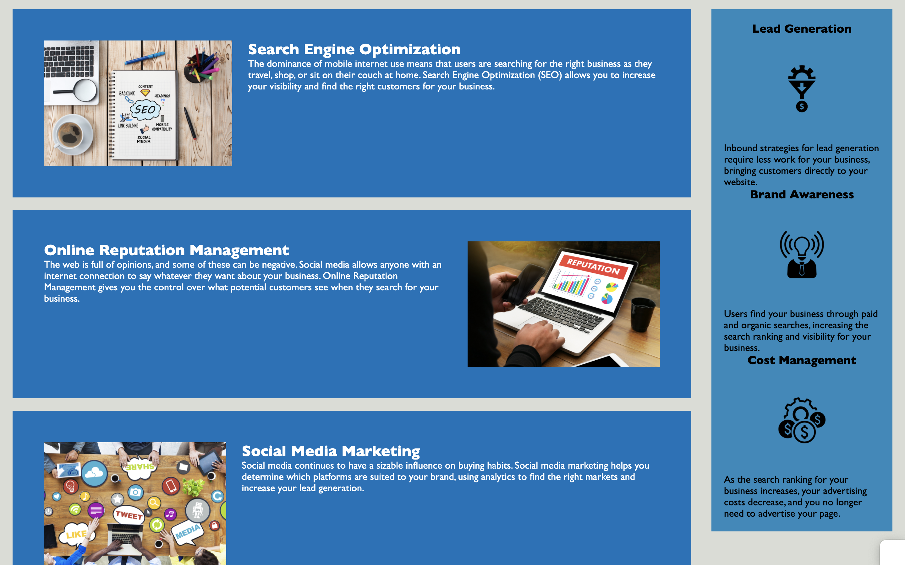

# Horiseon Refactory

Visit Here! https://rwood022.github.io/Horiseon-Refactory/

# Description
Horiseon Refactory is an application I refactored by organizing selectors and properties to follow the semantic structure of HTML elements. The purpose of this exercise was to correct HTML and CSS syntax errors while maintaining the visual integrity of the application. 

  

# Tasks Completed
1. Corrected titled of application
2. Organized sections into classes by following proper HTML semantics
3. Added corresponding classes to CSS file
4. Added descriptions (alt tags) to images
5. Added notes to both HTML and CSS files

# Visuals

